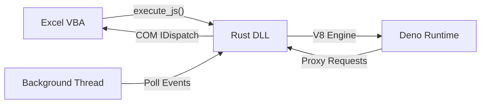

# 🚀 Excel Deno Bridge

**Excel Deno Bridge** — это сверхмощная надстройка для Microsoft Excel, которая заменяет устаревший VBA на современный **JavaScript (V8/Deno)**.

Система построена на "святой троице" технологий:
1. **Excel (VBA)** — как графический интерфейс и загрузчик.
2. **Rust (DLL)** — как высокопроизводительный, безопасный мост между COM-объектами Windows и движком JS.
3. **Deno Core (V8)** — как встроенная среда исполнения JavaScript с поддержкой асинхронности (`async/await`) и `fetch`.

## ✨ Основные возможности

* **Полный доступ к Excel API:** Управляйте ячейками, листами, книгами и форматированием напрямую из JS через объект `globalThis.Excel`.
* **Фоновый мониторинг (Event Loop):** Отдельный поток на Rust следит за изменениями в Excel и передает события в JS без зависаний интерфейса.
* **Современный JS:** Используйте `map`, `filter`, `reduce`, стрелочные функции и шаблоны строк вместо неуклюжего синтаксиса VBA.
* **Асинхронный Fetch:** Загружайте данные из любых API (Binance, Crypto, CRM, SQL) прямо в ячейки таблицы.
* **Native Heartbeat:** Системный таймер Windows внутри DLL гарантирует, что ваши JS-скрипты будут работать, даже если VBA стоит на паузе.
* **Hot Reload:** Меняйте код в `logic.js`, и он обновится в Excel без перезапуска программы.

## 🏗 Архитектура



## 🛠 Установка и запуск

### 1. Подготовка файлов
Убедитесь, что в папке с вашей книгой `.xlsm` лежат следующие файлы:
* `excel_deno_bridge.dll` — скомпилированная библиотека Rust.
* `logic.js` — ваш основной файл с логикой на JavaScript.
* `excel.d.ts` — файл определений типов для комфортной разработки в VS Code.

### 2. Импорт VBA модуля
Импортируйте модуль `DenoCore.bas` в ваш проект Excel. Основная функция для вызова:
```vba
res = DenoCore.Eval("1 + 1") ' Вернет "2"
```

### 3. Настройка `logic.js`
Создайте файл `logic.js` в кодировке **UTF-8**. Пример базового кода:
```javascript
// Обработчик событий изменения ячеек
globalThis.onExcelEvent = async (name, data) => {
    if (name === 'cell_change') {
        Excel.StatusBar = `Изменено: ${data}`;

        if (data === "ошибка") {
            Excel.ActiveCell.Interior.Color = 0x0000FF; // Красный (BGR)
        }
    }
};

// Запуск мониторинга
startExcelEvents();
```

## 💻 Примеры использования

### Получение курса криптовалют (Асинхронно)
```javascript
if (data.startsWith("курс")) {
    const coin = data.split(" ")[1];
    const res = await fetch(`https://api.binance.com/api/v3/ticker/price?symbol=${coin}USDT`);
    const json = await res.json();
    Excel.ActiveCell.Value = `Цена: $${parseFloat(json.price).toFixed(2)}`;
}
```

### Сложное форматирование
```javascript
const range = Excel.Range("A1:D10");
range.Font.Bold = true;
range.Borders.LineStyle = 1;
```

## ⌨️ Разработка (Typings)

Для максимальной продуктивности откройте папку проекта в **VS Code**. Благодаря файлу `excel.d.ts`, вы получите:
* Автодополнение имен методов (IntelliSense).
* Подсказки по типам данных.
* Мгновенное обнаружение опечаток.

## ⚠️ Важные нюансы

1. **Кодировка:** Всегда сохраняйте `.js` файлы в **UTF-8**.
2. **Цвета:** Excel использует формат **BGR** (Blue-Green-Red) вместо стандартного RGB. Пример: Красный = `0x0000FF`, Синий = `0xFF0000`.
3. **Режим редактирования:** Когда вы вводите текст в ячейку (курсор мигает), COM-интерфейс Excel заблокирован. События будут обработаны сразу после нажатия **Enter** или **Ctrl+Enter**.

---
**Excel Deno Bridge** — Сделано с помощью Rust 🦀 и V8 ⚡.
Наслаждайтесь программированием в Excel снова!
